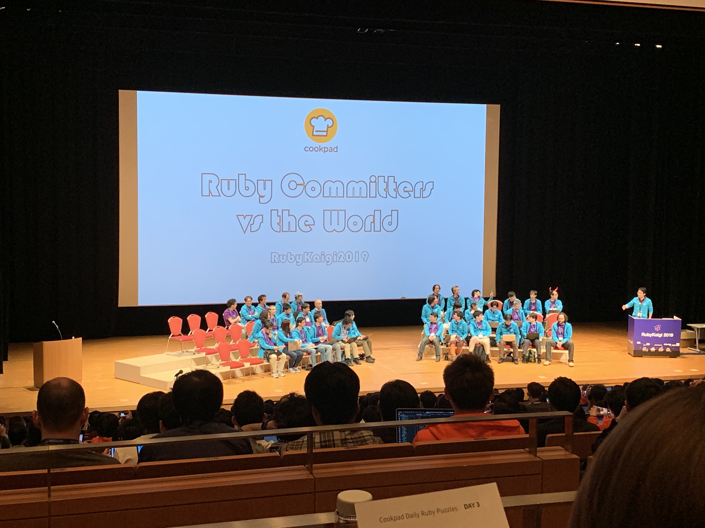

# Rubykaigi2019

## 概要

https://rubykaigi.org/2019

### 期間

2019/4/18(木) ~ 2019/4/20(土)

### 会場

福岡国際会議場

### 参加者・スポンサー

|  |  |
|-|-|
|  |  |

## 内容

### セッション

#### 基調講演

| | |
|-|-|
|  |  |

* まつもとゆきひろ氏よりRuby3についての話
* 静的解析、パフォーマンス向上などに力を入れていく
* 2020年の12月頃にリリースできるのを期待

#### Ruby開発者会議

* Rubyに取り入れたい機能について、Ruby開発者たちが議論
* 白熱しながらも、時にユーモアを混ぜていて、聞いていて面白かった

#### その他

* Rubyの標準ライブラリのパフォーマンスを向上させた話
* Rubyでフロントエンド用フレームワークを作ってみた話
* Rubyの安定版をメンテしていく際の失敗談

など

### 昼食

|  | |
|-|-|
|  |  |
|  |  |

* 弁当のほか、福岡らしく屋台もあった

### パーティなど

|  |  |  |
|-|-|-|
|  |  |  |
|  |  | |

* スポンサー主催のイベントがいくつかあり、前日のクルージングに参加
* 初日のオフィシャルパーティは、商店街を貸し切り(!)
  * 地元のテレビ局なども来ており、ニュースになっていた
* 参加者主催の非公式懇親会に参加し、ボードゲームやった  

### その他

| | | |
|-|-|-|
|  |  | 
|  |  |
|  |  |

## 感想

* 参加者の多さとその熱気に驚き。Ruby好きが年に一度集まるお祭りという雰囲気だった
* 話に聞いた通り、発表内容はRubyの内部実装に関するものが中心のため、実務に直接役立つ内容は少ない
  * 話の内容も難しいものが多く、理解が追いつかないものもあった
* スポンサーブースが多く、開催中常に人が行き交っており、盛り上がっていた
  * 各社のノベルティも多彩で凝ったものが多かった  
* 自身の英語力の無さを痛感。。。
  * 昼食時に外国人に話かけられるも、まともに返せず終了。。
